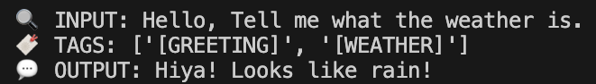

<p align="center">
  
</p>

# Token Flow Pre Generation (TFPG)

**by AGGM**  
MIT Licensed

---

**Token Flow Pre Generation (TFPG)** is a lightweight, tag-based text classification and expansion engine.  
It maps text input to relevant tags and then dynamically expands them into expressive or context-aware outputs.

---

## Features

- Simple keyword-based tagging
- Dynamic output generation via randomized tag expansions
- Modular and easy to integrate into other AI or NLP projects

---

## Example

```python
from TFPG import TokenFlow

if __name__ == "__main__":
    TokenFlow.process("Hello, Tell me what the weather is.")

```

<p align="center">
    
</p>
